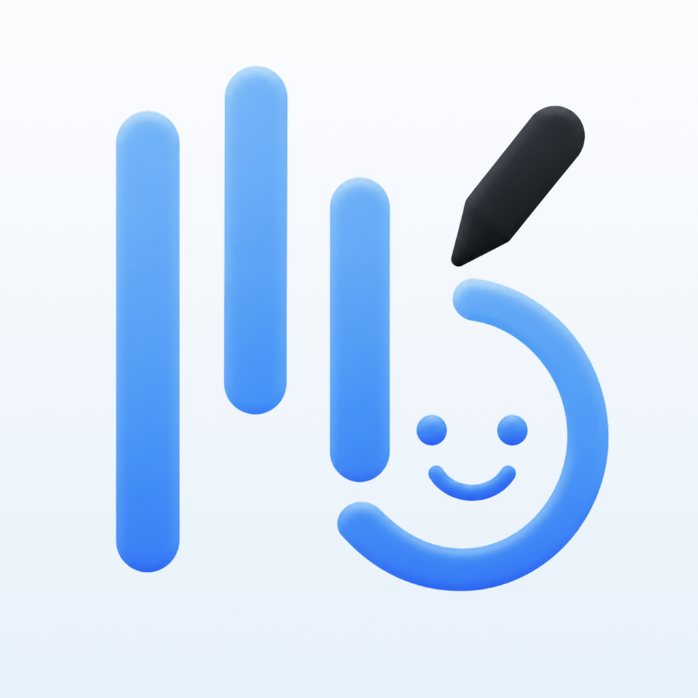
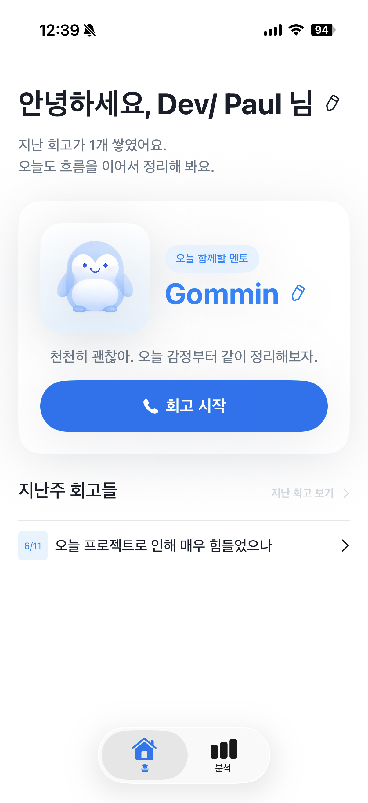
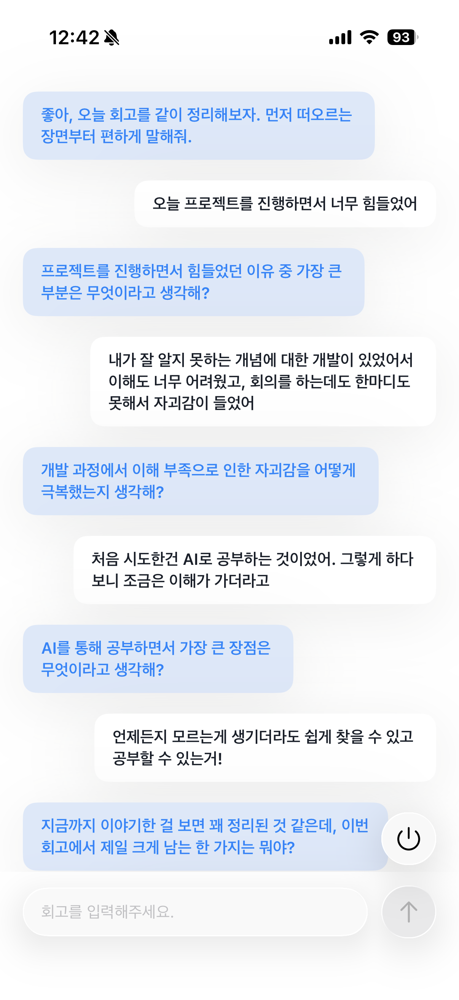
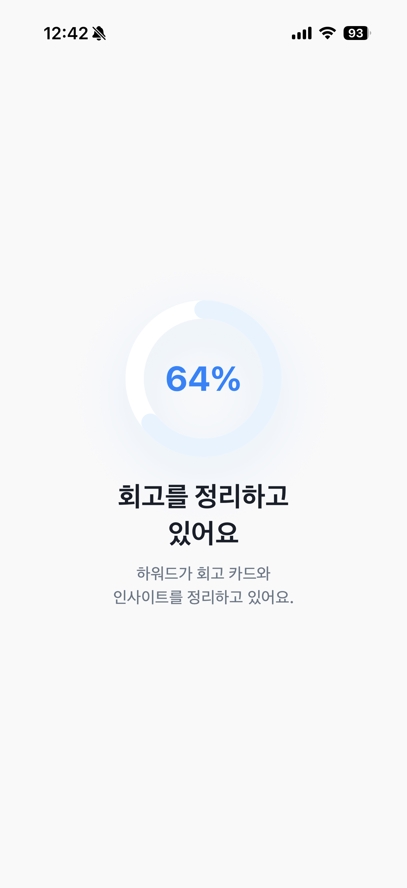
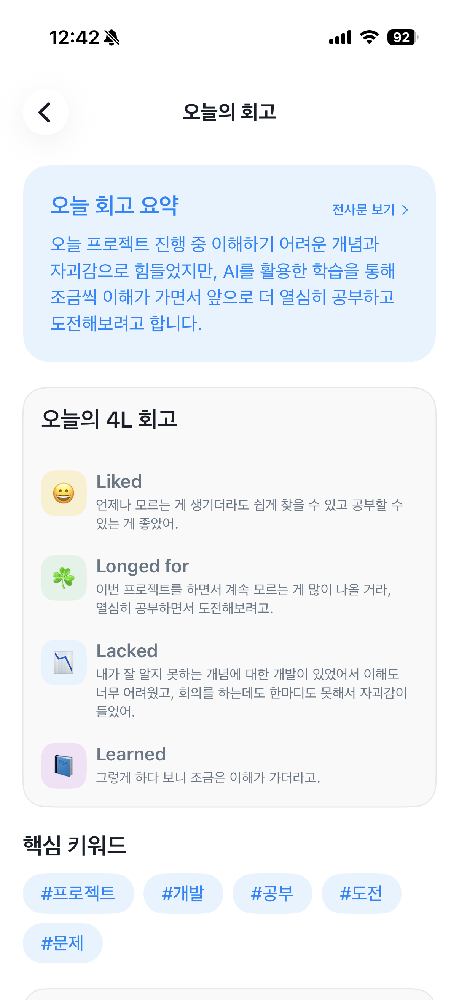

# :iphone: Reflectoo

AI 멘토와 대화하며 하루를 회고하고, 4L 기반 리포트와 감정/인사이트 분석까지 이어지는 iOS 회고 앱

## :fireworks: Screenshots

| 온보딩 | 메인 탭 | 회고 채팅 | 회고 리포트 |
| --- | --- | --- | --- |
|  |  |  |  |

## :pushpin: Features

- 사용자 정보와 멘토 선택 기반 온보딩 플로우
- AI 멘토와의 회고 채팅 및 회고 종료 확인 플로우
- 4L 분류, 요약, 핵심 키워드, Action Item 생성
- 오늘의 회고 리포트와 지난 회고 아카이브 조회
- SwiftData 기반 프로필, 회고 세션, 분석 결과 저장
- 월별 지난 회고 탐색 및 분석 탭 기반 감정/인사이트 확인

## :sparkles: Skills & Tech Stack

, 
, 
, 
, 
, 

- Architecture: SwiftUI + MVVM
- AI Pipeline: Foundation Model + 4L Classifier + Reflection Summary
- Persistence: SwiftData

### Technical Docs

- [Foundation Models](Docs/FoundationModels.md)
- [SwiftData](Docs/SwiftData.md)
- [Core ML](Docs/CoreML.md)
- [NaturalLanguage](Docs/NaturalLanguage.md)

### Appendix

- [Piper](Docs/Piper.md)

## :people_hugging: Authors

|  |  |  |  |  |
| --- | --- | --- | --- | --- |
|  |  |  |  |  |
| [IIIBreakeRIII](https://github.com/IIIbreakerIII) | [chami3i](https://github.com/chami3i) | [dlsundn](https://github.com/dlsundn) | [magic3ightball](https://github.com/magic3ightball) | [stevekoun](https://github.com/stevekoun) |
| Dev/ Paul | - | - | Hyerim Jeong | - |
