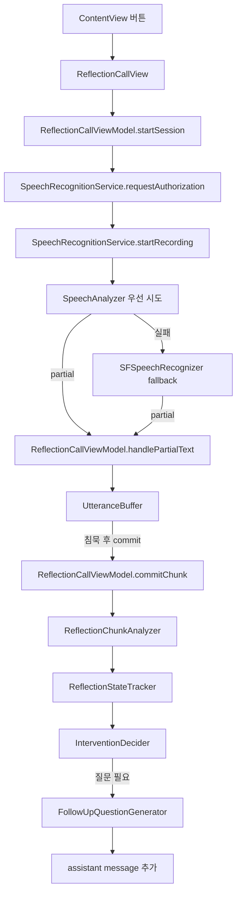

# Retrospective-Rulersalmon Implementation Analysis

이 문서는 현재까지 구현된 회고 통화형 기능의 구조와 동작 흐름을 정리한 코드 분석 문서다.  
목표는 “지금 앱이 실제로 어떻게 동작하는지”를 한 번에 파악할 수 있게 만드는 것이다.

## 1. 현재 구현 상태 요약

- 메인 화면의 버튼으로 회고 전용 페이지([ReflectionCallView](./Retrospective-Rulersalmon/Views/ReflectionCallView.swift))로 이동한다.
- 회고 페이지에서는 STT 입력과 수동 입력을 모두 받을 수 있다.
- STT는 `SpeechAnalyzer`/`SpeechTranscriber`를 우선 사용하고, 실패하면 `SFSpeechRecognizer`로 fallback 한다.
- partial transcript는 바로 분석하지 않고, `UtteranceBuffer`에서 잠시 보관한 뒤 안정화된 chunk로 넘긴다.
- chunk는 `ReflectionChunkAnalyzer`에서 정리/분석되고, `ReflectionStateTracker`가 4L 상태를 누적한다.
- follow-up 질문은 아직 Foundation Model이 아니라 템플릿 기반 생성이다.

## 2. 전체 동작 흐름

## 3. 뷰 계층

### `ContentView`

- [ContentView.swift](./Retrospective-Rulersalmon/Views/ContentView.swift)
- 역할:
  - 앱 첫 화면 역할
  - 회고 기능으로 이동하는 진입 버튼 제공
- 동작:
  - 사용자가 버튼을 누르면 `ReflectionCallView`로 이동한다.

### `ReflectionCallView`

- [ReflectionCallView.swift](./Retrospective-Rulersalmon/Views/ReflectionCallView.swift)
- 역할:
  - 현재 회고 기능의 UI를 모두 보여주는 화면
- 구성:
  - 녹음 시작/중지 버튼
  - 직접 입력 필드
  - live transcript 표시
  - 현재 follow-up 질문 표시
  - 4L 상태 카드
  - 대화 메시지 목록
  - chunk 분석 결과 목록
- 특징:
  - 아직 최종 운영 UI라기보다, 디버그와 검증에 가까운 화면이다.
  - 현재 내부 상태를 거의 다 보여줘서 흐름 파악에는 좋지만, 실제 사용자용으로는 다소 정보가 많다.

## 4. ViewModel 분석

### `ReflectionCallViewModel`

- [ReflectionCallViewModel.swift](./Retrospective-Rulersalmon/ViewModels/ReflectionCallViewModel.swift)
- 역할:
  - STT 입력, 수동 입력, chunk 확정, 상태 누적, 질문 판단을 한 흐름으로 연결한다.

#### 주요 함수

- `startSession()`
  - 음성 인식 권한을 요청하고, 허용되면 녹음을 시작한다.
  - 실패하면 `alertMessage`로 사용자에게 에러를 보여준다.

- `stopSession()`
  - 녹음을 중지하고 `UtteranceBuffer`를 초기화한다.

- `toggleRecording()`
  - 녹음 중이면 중지, 아니면 시작한다.

- `sendManualText()`
  - 입력창의 텍스트를 직접 회고 chunk로 처리한다.

- `handlePartialText(_:)`
  - STT partial 결과를 받는다.
  - `liveTranscript`를 갱신하고 `UtteranceBuffer`에 전달한다.

- `commitChunk(_:)`
  - 실제 회고 단위 하나를 처리하는 핵심 함수다.
  - chunk 생성 -> 분석 -> 메시지 추가 -> 상태 누적 -> 개입 판단 -> 질문 생성 순서로 동작한다.

- `progressText(for:)`
  - 각 4L slot confidence를 퍼센트 문자열로 바꾼다.

- `debugLog(_:)`
  - 콘솔에 `[ReflectionCall]` prefix로 로그를 찍는다.

## 5. STT 계층 분석

### `SpeechRecognitionService`

- [SpeechRecognitionService.swift](./Retrospective-Rulersalmon/Services/SpeechRecognitionService.swift)
- 역할:
  - 실제 마이크 입력을 받아 텍스트로 바꾸는 서비스

#### 현재 동작

- iOS 26 이상에서는 `SpeechAnalyzer` + `SpeechTranscriber`를 먼저 시도한다.
- 지원되지 않거나 실패하면 `SFSpeechRecognizer`로 fallback 한다.
- 결과는 모두 partial transcript 형태로 ViewModel에 전달된다.

#### 핵심 포인트

- analyzer 경로는 새 방식이고, 더 현대적인 STT 흐름이다.
- legacy recognizer 경로는 안전망 역할이다.
- 지금 구조는 “지원되면 analyzer, 아니면 fallback”이다.

## 6. Chunk 안정화 계층

### `UtteranceBuffer`

- [SpeechChunkBuffer.swift](./Retrospective-Rulersalmon/Services/SpeechChunkBuffer.swift)
- 실제 구현은 `UtteranceBuffer`이고, `SpeechChunkBuffer`는 호환용 alias다.
- 역할:
  - partial transcript를 바로 commit하지 않고 잠시 모아서 안정화된 발화 단위로 만든다.

#### 동작 방식

- 새 partial이 들어오면 최신 텍스트로 갱신한다.
- 같은 partial이 반복되면 중복 예약을 줄인다.
- 1.2초 정도 입력이 멈추면 commit 가능성을 판단한다.
- 다음 조건을 본다.
  - 문장 종결 여부
  - 주제 전환 표현 여부
  - 충분한 길이인지 여부
  - 최소한의 의미 있는 길이인지 여부
- commit할 때는 이전에 이미 반영한 부분과 overlap을 계산해서 중복 chunk를 줄인다.

#### 의미

- Phase 2의 핵심은 이 버퍼다.
- 지금은 STT partial이 조금씩 변해도 앱 전체 상태가 흔들리지 않게 만드는 역할을 한다.

## 7. 분석 계층

### `ReflectionChunkAnalyzer`

- [ReflectionChunkAnalyzer.swift](./Retrospective-Rulersalmon/Services/ReflectionChunkAnalyzer.swift)
- 역할:
  - 확정된 chunk를 정리하고, 4L 분석에 필요한 정보를 추출한다.

#### 하는 일

- filler 제거
- chunk type 추론
- 4L dimension 후보 추론
- 감정 키워드 추출
- evidence 생성
- summary 생성
- confidence 계산

#### 현재 한계

- 키워드 기반 휴리스틱이라 정확도가 높지는 않다.
- 한국어 표현이 다양해질수록 오탐/미탐 가능성이 있다.
- 즉, 현재는 “정교한 의미 이해”보다는 “대충 맞는 회고 흐름 추적”에 가깝다.

## 8. 상태 추적 계층

### `ReflectionStateTracker`

- [ReflectionStateTracker.swift](./Retrospective-Rulersalmon/Services/ReflectionStateTracker.swift)
- 역할:
  - 분석 결과를 4L 상태에 누적한다.

#### 동작

- analysis에 포함된 dimension을 확인한다.
- 해당 slot에 evidence, summary, confidence를 반영한다.
- `lastUserChunk`를 업데이트한다.

#### 해석

- 사용자가 무엇을 말했는지 기록하면서, 어떤 4L 영역이 채워졌는지 누적하는 구조다.
- 현재 구현은 꽤 단순해서 evidence만 있으면 slot이 비교적 빨리 만족 처리된다.

## 9. 개입 판단 계층

### `InterventionDecider`

- [InterventionDecider.swift](./Retrospective-Rulersalmon/Services/InterventionDecider.swift)
- 역할:
  - 지금 AI가 질문해도 되는지 판단한다.

#### 현재 규칙

- 마지막 AI 질문 이후 8초가 지나지 않으면 개입하지 않는다.
- 시간이 충분하면 부족한 4L slot을 우선순위대로 검사한다.
  - learned
  - lacked
  - longedFor
  - liked
- 하나라도 비어 있으면 해당 dimension을 target으로 삼는다.

#### 현재 한계

- 사용자가 지금 말하는 중인지, 막 말한 직후인지 같은 맥락은 아직 충분히 반영하지 않는다.
- 즉, 질문 타이밍은 아직 휴리스틱 수준이다.

## 10. 질문 생성 계층

### `FollowUpQuestionGenerator`

- [FollowUpQuestionGenerator.swift](./Retrospective-Rulersalmon/Services/FollowUpQuestionGenerator.swift)
- 역할:
  - 부족한 4L 항목에 맞는 짧은 질문을 만든다.

#### 현재 방식

- `liked`, `learned`, `lacked`, `longedFor`별로 질문 템플릿이 몇 개씩 있다.
- 그중 하나를 랜덤으로 고른다.
- 즉, 현재 질문은 Foundation Model이 아니라 **템플릿 기반**이다.

#### 의미

- 질문 문장은 안정적이고 예측 가능하다.
- 대신 문맥 적응력은 아직 낮다.

## 11. 모델 계층

현재 주요 모델:

- [ReflectionDimension.swift](./Retrospective-Rulersalmon/Models/ReflectionDimension.swift)
- [ReflectionSlot.swift](./Retrospective-Rulersalmon/Models/ReflectionSlot.swift)
- [ReflectionState.swift](./Retrospective-Rulersalmon/Models/ReflectionState.swift)
- [ChunkType.swift](./Retrospective-Rulersalmon/Models/ChunkType.swift)
- [SpeechChunk.swift](./Retrospective-Rulersalmon/Models/SpeechChunk.swift)
- [ChunkAnalysis.swift](./Retrospective-Rulersalmon/Models/ChunkAnalysis.swift)
- [InterventionDecision.swift](./Retrospective-Rulersalmon/Models/InterventionDecision.swift)
- [ChatMessage.swift](./Retrospective-Rulersalmon/Models/ChatMessage.swift)

### 역할 정리

- `ReflectionDimension`
  - 4L의 기준 축을 정의한다.
- `ReflectionSlot`
  - 각 축의 누적 상태를 담는다.
- `ReflectionState`
  - 전체 회고 상태를 하나로 묶는다.
- `SpeechChunk`
  - 하나의 발화 단위를 표현한다.
- `ChunkAnalysis`
  - 발화 분석 결과를 담는다.
- `InterventionDecision`
  - AI가 개입할지 여부와 대상 dimension을 담는다.

## 12. 현재까지의 Phase 상태

- Phase 1: 완료
- Phase 2: 완료
- Phase 3: 부분 반영
- Phase 4: 부분 반영
- Phase 5: 부분 반영
- Phase 6: 부분 반영
- Phase 7: 미완료
- Phase 8: 부분 반영
- Phase 9: 미완료

### 해석

- 지금 구현은 “동작하는 최소 회고 엔진”은 갖췄다.
- 하지만 아직 완전한 통화형 코디네이터 구조로 분리되지는 않았다.
- 그래서 현재 상태는 MVP와 리팩토링 중간 지점이라고 보는 게 맞다.

## 13. 실제로 잘 되는 부분

- 메인 화면에서 회고 화면으로 이동한다.
- STT 시작/중지 흐름이 연결되어 있다.
- analyzer -> fallback 구조가 있다.
- partial transcript를 바로 분석하지 않고 안정화 버퍼를 거친다.
- 수동 입력도 같은 분석 경로를 탄다.
- 4L 상태와 follow-up 질문이 화면에 보인다.
- 빌드는 통과한다.

## 14. 아직 거친 부분

- chunk 경계 판단은 여전히 휴리스틱이다.
- 4L 상태 만족 판정이 다소 빠르다.
- 질문 타이밍이 대화 맥락보다 시간 간격에 더 의존한다.
- 질문 생성은 FM이 아니라 템플릿이다.
- UI는 아직 디버그/검증 성격이 강하다.

## 15. 다음 단계 추천

1. Phase 3: chunk pre-processing 정교화
2. Phase 4: 4L 상태 추적 기준 개선
3. Phase 5: 개입 판단에 “사용자 발화 중 여부” 반영
4. Phase 6: 질문 템플릿 품질 개선
5. Phase 7: coordinator 도입으로 흐름 분리

## 16. 한 줄 결론

현재 앱은 “STT 입력을 받아 4L 회고 상태를 누적하고, 부족한 항목에 대해 템플릿 질문을 던지는 프로토타입”까지는 실제로 동작한다.  
다만 의미 이해와 질문 타이밍은 아직 휴리스틱 기반이라, 다음 단계에서 흐름 분리와 판단 정교화가 필요하다.
